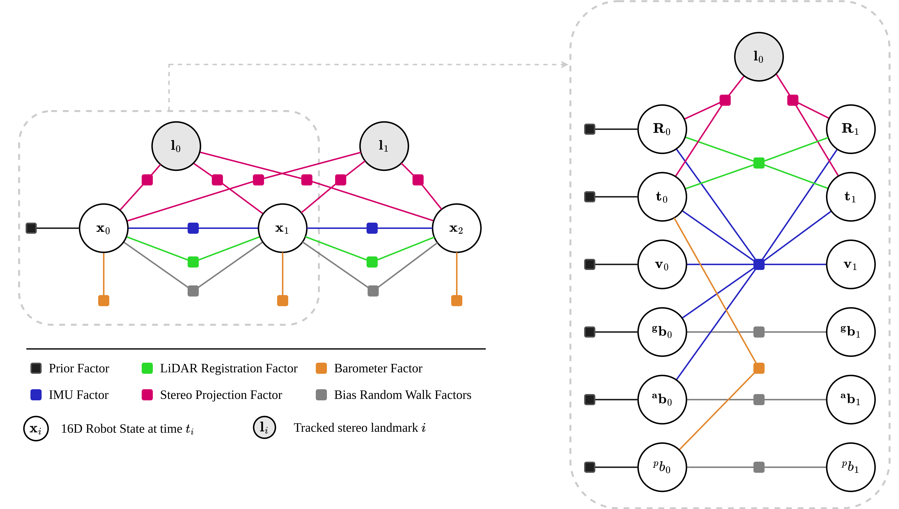

# SERPENT (State Estimation through Robust Perception in Extreme and Novel Terrains)

## System Overview

This repository houses a package suite for lidar/visual/inertial/plus SLAM for the EELS mission concept.

SERPENT builds and optimises a factor graph online as shown in the factor graph below. This factor graph contains a 16-dimensional robot state, including position (3-dim), rotation (3-dim), accelerometer bias (3-dim), gyroscope bias (3-dim) and barometer bias (1-dim).



The intention is for SERPENT to be run with any subset of sensor modalities, with the current options being:

 * IMU
 * LiDAR
 * Stereo
 * Barometer

The current best results are achieved with IMU + LiDAR + Barometer. Stereo is not currently working correctly.

## Known Limitations

In addition to specific issues which are tracked through version control, SERPENT has some limitations:

1. Unfortunately there are currently some implicit assumptions in the implementation which mean that not all combinations of sensor modalities can be run. More specifically, IMU and LiDAR streams are currently required for the code to run. Having said this, they need not be included as factors in the graph. Generalising to all combinations of input sensor modalities is on the roadmap.
2. Stereo factors usually result in an crash in the optimisation backend, often in the form of a `IndeterminantLinearSystemError`.
3. Currently the system is sensitive to having message drop for intra-node communication (it is fine if inputs, such as LiDAR, stereo frames or IMU are dropped).
4. Point-to-plane ICP covariance estimation methods that use a non-spherical LiDAR sensor noise model are not strictly valid when using VoxelGrid filtering, especially in the mapping module.
5. SERPENT has only been tested with an Ouster OS0, and the formatting module is quite limited in what types of point clouds it supports. New LiDARs will likely require an extension of this module.
6. The barometer is fused when available (can be after optimisation) because on the tested system barometer measurements occured at a low frame rate. This highlights the fact that there are implicit assumptions in the code about the sensor rates.

## Roadmap

1. Provide demos/datasets, example configuration and launch files for new users. Current working configuration/launch files for the EELS robot are in closed-source repositories.
2. Generalise frontend to take as input any combination of sensor streams - do not require IMU and LiDAR. For example separate the idea of "sensor_factor" from "sensor", because we want to use IMU for initialisation and motion estimation even if not tightly fused in the backend, and we don't want the system to hang if no IMU stream is available.
3. Redesign and robustify the stereo tracking pipeline, including addition of RANSAC, ideally guided by the motion prediction (from IMU or forward propagation of current velocity if available).
4. Robustify system to sensor dropout.
5. Multi-IMU support/integration.
6. Detailed documentation on configuration options.
7. Careful considerations of sensor rates for sensor fusion, and subsequent generalisation of frontend and backend.
8. Multi-stereo support/integration.

## System Structure (development)


## Dependencies

The following dependencies assume a Ubuntu 20.04 system. This section is ordered roughly in the order that dependencies should be installed.

### ROS noetic

Follow the install instructions at http://wiki.ros.org/noetic/Installation/Ubuntu.

The remaining instructions assume a `catkin` workspace initialised at `~/catkin_ws`. If you system configuration differs then modify the instructions accordingly.

It is recommended that all packages be built in a release mode. You can modify your `catkin` configuration with:

```bash
cd ~/catkin_ws
catkin config --cmake-args -DCMAKE_BUILD_TYPE=RelWithDebInfo
```

### Eigen3

Tested with 3.3.7, the default Ubuntu 20.04 release at time of writing.

Ubuntu 20.04:
```bash
sudo apt install libeigen3-dev
```

### fast_gicp

Follow the ROS build instructions at https://github.com/SMRT-AIST/fast_gicp. In summary:

```bash
cd ~/catkin_ws/src
git clone git@github.com:SMRT-AIST/fast_gicp.git
cd ~/catkin_ws
catkin build fast_gicp
```

### GTSAM

Tested with 4.0.3, the latest stable release of GTSAM 4 available on Ubuntu 20.04, and 4.2.0 installed from source.

There are two reasons to install a recent version of GTSAM from source:

* The barometer factor is only available in 4.2.0. If you want to integrate barometer measurments it is necessary to install GTSAM >= 4.2.0 from source.

* There is a minor bug in `gtsam::CombineImuFactor` which was only resolved in the `4.2a8` pre-release of `4.2.0` which may have a small effect on accuracy. See https://github.com/borglab/gtsam/pull/874 and https://github.com/borglab/gtsam/issues/368 for more details.

#### GTSAM 4.0.3

Ubuntu 20.04 (instructions at https://gtsam.org/get_started/):
```bash
sudo apt-get install software-properties-common
sudo add-apt-repository ppa:borglab/gtsam-release-4.0
sudo apt install libgtsam-dev
```

Uninstall with:
```bash
sudo apt remove libgtsam-dev
sudo apt autoremove
```

#### GTSAM >=4.2.0

```bash
git clone git@github.com:borglab/gtsam.git
cd gtsam
git checkout <version>
mkdir build && cd build
cmake ..
make -j
make check -j
sudo make install
```

Note there may be some `cmake` parameters of interest, which can be easily configured with `ccmake ..`.

Uninstall with:
```bash
cd build
sudo make uninstall
```

### OpenCV

Tested with 4.2.0, the Ubuntu 20.04 default, and 4.6.0 installed from source. SERPENT uses SIFT as one of its stereo feature types, however SIFT lost its patent only in March 2020, so is only part of core OpenCV starting from version 4.4.0. Therefore you will not be able to use SIFT features if installing a version before 4.4.0.

#### OpenCV 4.2.0

```bash
sudo apt install libopencv-dev
```

#### OpenCV >=4.6.0

```bash
git clone git@github.com:opencv/opencv.git
git clone git@github.com:opencv/opencv_contrib.git
cd opencv
git checkout <version>
cd ../opencv_contrib
git checkout <version>
cd ../opencv
mkdir build && cd build
cmake -DOPENCV_EXTRA_MODULES_PATH=../../opencv_contrib-4.x/modules ..
cmake --build . -j
sudo cmake --build . --target install
```

If it is desirable to keep an older version of OpenCV installed on your system, you can do so, making sure to turn on the OPENCV_ENABLE_NONFREE flag while building.

**Note that if you install OpenCV from source, you must also install `cv_bridge` from source.**

### cv_bridge

If you installed OpenCV from source (see OpenCV section), you will have to install `cv_bridge` from source to avoid conflicting opencv libraries. One way to build cv_bridge from source:
```bash
cd ~/catkin_ws/src
git clone git@github.com:ros-perception/vision_opencv.git
cd vision_opencv
git checkout noetic
cd ~/catkin_ws
catkin build cv_bridge
```

`cv_bridge` should now be linked to your installed version of OpenCV.

### PCL

Tested with 1.10, the default version for Ubuntu 20.04. This usually comes with a full ROS install.
```bash
sudo apt install libpcl-dev
```

### pcl_conversions

```bash
sudo apt install ros-noetic-pcl-conversions
```

## Build

First clone the repository to your `~/catkin_ws/src`.

Build in release mode (or similar) for real-time operation:
```bash
cd ~/catkin_ws
catkin build serpent
source ~/catkin_ws/devel/setup.bash
```

If you did not configure your `catkin` environment to build in a release mode, then you should build with `--cmake-args -DCMAKE_BUILD_TYPE=RelWithDebInfo` (see ROS section).

## Usage

### Configuration

SERPENT provides many configuration options for the system, for which a set of defaults can be found in `serpent/config`. Here is a description of each file:

| File                  | Description  |
|-----------------------|--------------|
| `debug`               | Parameters which if `true` may provide extra output (console or visualisation) at some computational cost. |
| `filter`              | Parameters which describe how to filter sensor data. Note that map filtering is in `tuning`.  |
| `format`              | Parameters which describe how to reformat incoming sensor data so that it can be understood by SERPENT.  |
| `mission`             | Parameters relating to the specific mission, such as initial pose, gravity, etc.  |
| `normal_estimation`   | Parameters relating to point cloud normal estimation.  |
| `robot`               | Parameters describing the configuration and properties of the robot, especially the rigid body (transform) frames.  |
| `tuning`              | Parameters for tuning SERPENT.  |

Here are some of the crucial parameters:

| File                  | Parameter/Parameter Block  | Description  |
|-----------------------|------------|--------------|
| `filter`              | `voxel_grid_filter/leaf_size` | This has a huge impact on point cloud size, and therefore real-time performance of SERPENT. The smaller the `leaf_size`, the slower all point cloud operations are but the more accurate the final result.  |
| `robot`               | `body_frames` | This must be set up correctly for SERPENT to work. The documentation in `eigen_ros/body_frames.hpp` describes how this is achieved, as well as the Frame Conventions section in this README. |
| `tuning`              | `imu` | This describes the noise characteristics of your IMU. |
| `tuning`              | `barometer` | This describes the noise characteristics of your barometer. |
| `tuning`              | `mdc` | Motion distortion correction of the LiDAR point cloud based on estimated motion over the sweep period. |
| `tuning`              | `optimisation` | Describes which factors are enabled, and whether to marginalise older states. |
| `tuning`              | `registration_covariance` | Describes the configuration of the registration covariance estimation method. |
| `tuning`              | `s2s` | Describes scan-to-scan registration. |
| `tuning`              | `s2m` | Describes scan-to-map (local map) registration. |
| `tuning`              | `mapping` | Describes the construction of the local and global maps. |
| `tuning`              | `stereo_factors` | Describes the covariance and noise model of stereo factors. |
| `tuning`              | `stereo_tracking` | Describes the configuration of the stereo tracking module. |

It is highly recommended that you create a set of configuration files for your exact purpose, modifying the defaults where necessary. In particular the following must be changed for any expectation of a working system:

* `body_frames` in `robot` configuration file
* `imu` in `tuning` configuration file
* `optimisation` in `tuning` configuration file

### Launching SERPENT

To run everything together:
```bash
roslaunch serpent serpent.launch <arg>:=<value> ...
```

To run the frontend and backend as separate processes:
```bash
roslaunch serpent serpent_frontend.launch <arg>:=<value> ...
```
```bash
roslaunch serpent serpent_backend.launch <arg>:=<value> ...
```

This latter option may be useful if, for example, you want to run SERPENT on a remote machine and only want to run the frontend on the robot, where the pointcloud can be deskewed and downsampled before it is sent over the network.

## Plotting Results

To generate plots for trials and compare to ground truth reference, first record the output odometry to file.

Then run `main.m` from its directory with MATLAB after configuring the config and plot options to your datatset.

To run from the command line:
```bash
matlab -nodisplay -nosplash -nodesktop -r "run('main.m'); exit;"
```

The following plots will be generated:

 - position vs ground truth, position APE, position RPE
 - orientation vs ground truth in angle-axis form, orientation APE, orientation RPE
 - linear velocity vs ground truth, linear velocity AE, linear velocity RE
 - angular velocity vs ground truth, angular velocity AE, angular velocity RE
 - covariance plots
 - stereo-feature to lidar distance plots

## Testing

```bash
catkin test serpent
```

## Reference Frame Conventions and Implementation

SERPENT uses the `eigen_ros::BodyFrames` abstraction layer in its handling of robot reference frames, which is compatible with the ROS TF tree architecture. It is important to keep in mind that frame and `frame_id` are two separate concepts, where `eigen_ros::BodyFrames` defines frames, with which ROS any number of `frame_id` can be associated. For example when messages are published to ROS or transforms must be looked up via the TF2 api, the `frame_id` is used. In order for SERPENT to operate correctly, it requires the following configuration parameters:

* `map_frame_id` which resides in the tuning config file (e.g. `tuning_default.yaml`), and defaults to `"map"` if not set explicitly.

* A `body_frames` block which defines the robot body frames in a way that is consistent with the documentation in `eigen_ros/body_frames.hpp`. The top-level frame (`body_frame_name` in the documentation) defined in this block is used by SERPENT as the body frame reference of all sensors during optimisation. There must also be a `base_link` frame somewhere in the hierarchy, or as a dynamic link. A typical use case will have the top-level frame `body_frame_name` set to `base_link` (note the `frame_id` can be set by the user to be different from `base_link`), but the `base_link` frame can in fact exist anywhere in the hierarchy, or as a `dynamic` link. SERPENT will produce map_frame -> base_link transforms and poses (with covariance), which may differ from the poses of the underlying optimisation (map_frame -> body_frame). Additionally the `body_frames` block must have an `imu` and `lidar` frame (with their `frame_id` each set to the frame_id of the sensor for your robot).

* If stereo factors are enabled, the frame of the left camera (note the frame_id) has to be specified in the `stereo_factors` block in the `left_cam_frame` parameter.

## Debugging

For the following options, SERPENT should be compiled with CMAKE_BUILD_TYPE set to `RelWithDebInfo` or `Debug`. See build section.

### gprof

Compile with:
```bash
catkin build serpent --verbose --cmake-args -DENABLE_GPROF=ON
```
Note that this option is cached, so needs to be turned `OFF` in a subsequent compilation.

After running there will be a `serpent.<pid>` file in `~/.ros/`.

### gdb

```bash
roslaunch serpent serpent.launch use_gdb:=true
```

### callgrind

The following should be sufficient to run the program with callgrind.
```bash
roslaunch serpent serpent.launch use_callgrind:=true
```

However despite the launch exitting cleanly when interupting with `CTRL+C` without callgrind, when running with callgrind it does not.

Using the `--sigint-timeout=SIGINT_TIMEOUT` and `--sigterm-timeout=SIGTERM_TIMEOUT` options (http://wiki.ros.org/roslaunch/Commandline%20Tools) was tried to give the program more time to shutdown cleanly, however this only very occasionally worked. Terminating the node through `rosnode kill /serpent` was also only occasionally successful.

The only reliable method found so far of generating a valid output file is to use the `callgrind_control --dump` command in a separate terminal.

The result can be visualised with:
```bash
kcachegrind ~/.ros/callgrind.serpent.<pid>.1
```
The `.1` is present if callgrind was dumped.

## Authors

Original Author: William Talbot (willat343)
Current Maintainer: William Talbot (willat343)
